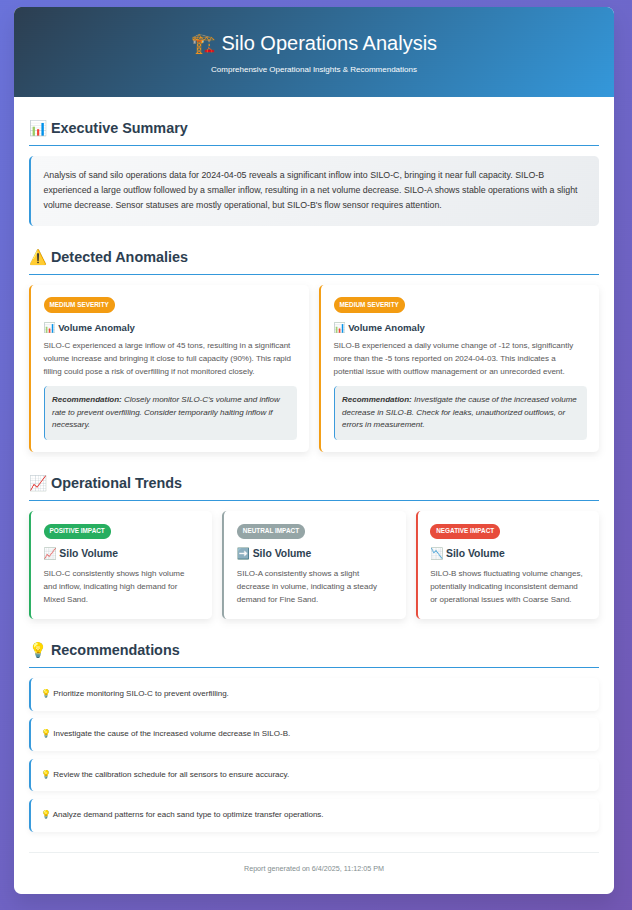

# Silo Operations Analysis PoC

This is a Proof of Concept (PoC) project that demonstrates the use of LangChain and Google's Gemini AI model for analyzing silo operations data. The system uses Retrieval Augmented Generation (RAG) to provide context-aware analysis of silo operations, identifying patterns, anomalies, and generating actionable insights.

## Features

- 🤖 Powered by Google's Gemini 2.0 Flash model
- 🔍 Context-aware analysis using RAG (Retrieval Augmented Generation)
- 🔄 Vector-based semantic search using Pinecone and Xenova transformers
- 📊 Structured insights generation including:
  - Anomaly detection with severity levels
  - Trend identification
  - Actionable recommendations
- 🌐 REST API endpoints for data analysis
- 📄 HTML report generation with beautiful, responsive design
- 📝 Support for both sample data and custom data input

## Technical Stack

- Node.js/TypeScript
- LangChain
- Google Generative AI (Gemini)
- Express.js
- Zod for data validation
- Pinecone Vector Database
- Xenova Transformers (all-MiniLM-L6-v2 model)

## Vector Store Implementation

The project uses a custom vector store implementation that:

- Utilizes Pinecone for vector similarity search
- Employs Xenova's all-MiniLM-L6-v2 model for embeddings
- Implements document chunking with overlap for better context
- Provides semantic search capabilities for relevant context retrieval
- Handles metadata sanitization and storage

## API Endpoints

### Health Check

```
GET /health
```

Returns the API health status.

### Analyze Silo Data

```
POST /api/analyze
```

Analyzes silo operations data and returns structured insights.

**Request Body:**

```json
{
  "siloData": [
    {
      "date": "2024-03-20",
      "siloId": "SILO-001",
      "currentVolumePercentage": 75.5,
      "dailyVolumeChange": -12.3,
      "materialType": "Mixed Sand",
      "transferOperations": [
        {
          "type": "inflow",
          "volume": 25.0,
          "durationHours": 2.5,
          "timestamp": "2024-03-20T08:00:00Z"
        },
        {
          "type": "outflow",
          "volume": 15.0,
          "durationHours": 1.75,
          "timestamp": "2024-03-20T14:30:00Z"
        }
      ],
      "sensorStatus": [
        {
          "sensorId": "TEMP-001",
          "status": "operational",
          "lastCalibrationDate": "2024-02-15T00:00:00Z"
        },
        {
          "sensorId": "HUM-001",
          "status": "maintenance",
          "lastCalibrationDate": "2024-03-01T00:00:00Z"
        }
      ],
      "temperature": 22.5,
      "humidity": 45.0,
      "notes": "Regular maintenance scheduled for next week"
    },
    {
      "date": "2024-03-20",
      "siloId": "SILO-002",
      "currentVolumePercentage": 92.0,
      "dailyVolumeChange": 5.5,
      "materialType": "Fine Sand",
      "transferOperations": [
        {
          "type": "inflow",
          "volume": 30.0,
          "durationHours": 3.0,
          "timestamp": "2024-03-20T09:15:00Z"
        }
      ],
      "sensorStatus": [
        {
          "sensorId": "TEMP-002",
          "status": "malfunction",
          "lastCalibrationDate": "2024-01-10T00:00:00Z"
        },
        {
          "sensorId": "HUM-002",
          "status": "operational",
          "lastCalibrationDate": "2024-03-15T00:00:00Z"
        }
      ],
      "temperature": 24.0,
      "humidity": 42.0,
      "notes": "High volume alert - approaching capacity"
    },
    {
      "date": "2024-03-20",
      "siloId": "SILO-003",
      "currentVolumePercentage": 15.2,
      "dailyVolumeChange": -8.7,
      "materialType": "Coarse Sand",
      "transferOperations": [
        {
          "type": "outflow",
          "volume": 20.0,
          "durationHours": 2.0,
          "timestamp": "2024-03-20T10:00:00Z"
        },
        {
          "type": "outflow",
          "volume": 12.0,
          "durationHours": 1.5,
          "timestamp": "2024-03-20T15:00:00Z"
        }
      ],
      "sensorStatus": [
        {
          "sensorId": "TEMP-003",
          "status": "operational",
          "lastCalibrationDate": "2024-03-01T00:00:00Z"
        },
        {
          "sensorId": "HUM-003",
          "status": "operational",
          "lastCalibrationDate": "2024-03-01T00:00:00Z"
        }
      ],
      "temperature": 21.8,
      "humidity": 48.0,
      "notes": "Low volume warning - consider refill"
    }
  ]
}
```

**Example Response:**

```json
{
  "summary": "Analysis of silo operations data for 2024-03-20 reveals sensor malfunctions, high and low volume alerts, and scheduled maintenance. SILO-002 is approaching capacity, while SILO-003 is nearing empty. HUM-001 in SILO-001 is under maintenance, and TEMP-002 in SILO-002 is malfunctioning.",
  "anomalies": [
    {
      "type": "sensor",
      "description": "TEMP-002 in SILO-002 is malfunctioning. Last calibration was on 2024-01-10T00:00:00Z.",
      "severity": "high",
      "recommendation": "Immediately investigate and repair or replace TEMP-002 in SILO-002 to ensure accurate temperature readings."
    },
    {
      "type": "volume",
      "description": "SILO-002 is approaching capacity (92%).",
      "severity": "medium",
      "recommendation": "Reduce inflow or increase outflow from SILO-002 to prevent overfilling."
    },
    {
      "type": "volume",
      "description": "SILO-003 has a low volume (15.2%).",
      "severity": "medium",
      "recommendation": "Increase inflow to SILO-003 to avoid running out of material."
    },
    {
      "type": "sensor",
      "description": "HUM-001 in SILO-001 is under maintenance. Last calibration was on 2024-03-01T00:00:00Z.",
      "severity": "medium",
      "recommendation": "Ensure HUM-001 maintenance is completed as scheduled to restore humidity monitoring."
    }
  ],
  "trends": [
    {
      "metric": "Daily Volume Change",
      "description": "SILO-001 and SILO-003 are experiencing negative daily volume changes, indicating material depletion.",
      "impact": "negative"
    },
    {
      "metric": "Current Volume Percentage",
      "description": "SILO-002 shows a high current volume percentage, indicating a potential overfill risk.",
      "impact": "negative"
    }
  ],
  "recommendations": [
    "Prioritize repair of TEMP-002 in SILO-002.",
    "Adjust transfer operations for SILO-002 to prevent overfilling.",
    "Increase inflow to SILO-003 to address low volume.",
    "Ensure timely completion of HUM-001 maintenance in SILO-001.",
    "Monitor daily volume changes across all silos to proactively manage material levels."
  ]
}
```

### Generate HTML Report

```
POST /api/generate-report
```

Generates a comprehensive HTML report with insights analysis and saves it as a file. The report includes styled visualizations of anomalies, trends, and recommendations.

**Request Body:**

```json
{
  "siloData": [
    // Same silo data structure as /api/analyze endpoint
    // If not provided, sample data will be used
  ]
}
```

**Example Response:**

```json
{
  "success": true,
  "insights": {
    // Same insights structure as /api/analyze endpoint
  },
  "reportUrl": "http://localhost:3000/public/reports/silo-report-2024-01-20T10-30-00-000Z.html",
  "filename": "silo-report-2024-01-20T10-30-00-000Z.html"
}
```

**HTML Report Features:**

- 🎨 Beautiful, responsive design with modern styling
- 📊 Executive summary section
- ⚠️ Color-coded anomaly cards with severity badges
- 📈 Trend analysis with visual indicators
- 💡 Actionable recommendations list
- 📅 Timestamp and report metadata
- 🌐 Accessible via web browser at the returned URL

The generated HTML report is saved to the `public/reports/` directory and can be accessed directly via the returned URL. Each report has a unique filename with timestamp to prevent conflicts.

**Sample HTML Report:**



_Example of the generated HTML report showing the modern, responsive design with anomaly cards, trend analysis, and recommendations._

### Load Sample Data

```
GET /api/sample-data
```

Returns sample silo operations data for testing purposes.

**Example Response:**

```json
{
  "siloData": [
    // Array of silo data objects with sample data
  ]
}
```

## Setup

1. Clone the repository
2. Install dependencies:
   ```bash
   npm install
   ```
3. Create a `.env` file with required environment variables:
   ```
   PORT=3000
   GOOGLE_API_KEY=your_google_api_key
   PINECONE_API_KEY=your_pinecone_api_key
   ```
4. Start the development server:
   ```bash
   npm run server:dev
   ```

## Development

This is a PoC project demonstrating the integration of LangChain with Google's Gemini model for industrial data analysis. The system is designed to be extensible and can be adapted for various industrial monitoring and analysis use cases.

The vector store implementation provides semantic search capabilities that enhance the context retrieval process, making the analysis more accurate and relevant. The system uses document chunking and embedding to efficiently store and retrieve relevant context from historical data.

## Note

This is a Proof of Concept and should not be used in production without proper testing and security measures.
